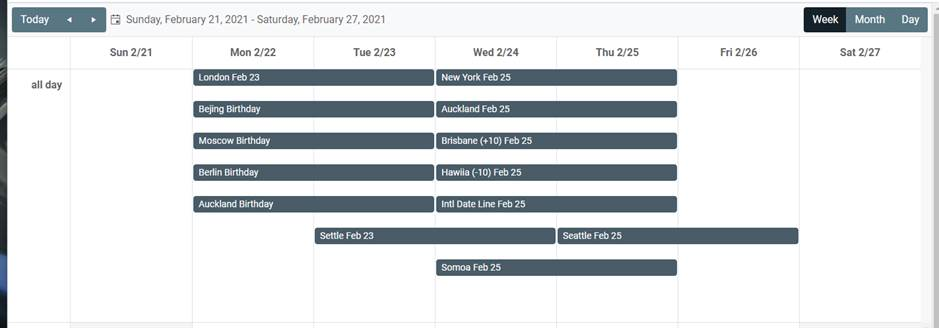
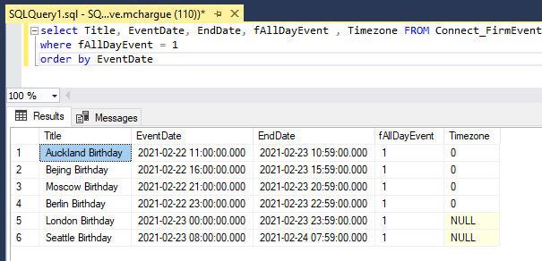
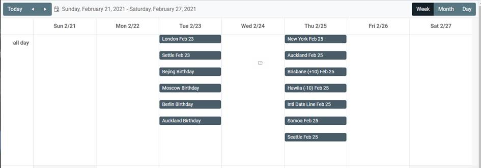

# Introduction 
The "Christmas Day Problem" is not about how to assemble a 300 piece playhouse an hour before the kids get up. It  refers to a common 
issue with events from a SharePoint Event List that are tagged as an All Day Event, and how those events are queried and displayed in
Handshake controls. Left as is, when Christmas Day is entered in the firm calendar by someone who works in the London office, then
when displayed on the firm home page for someone in Seattle, it will show Christmas Day being on Dec 24.

 This solution shows you how to get all day events to display correctly regardless of the timezone of the SharePoint Server, the author 
 of the event or the person viewing that event. 

 ## Solution Components
 The solution to this problem has several layers dealing with how all day events are stored, queried and displayed.  Some Assumptions to start:

 1. The SharePoint Site Collection is set to the desired timezone. The specific timezone is not relevant to the solution, but it should be a known entity.
 2. Each user has the appropriate Timezone set for their SharePoint User Profile.  This will be the timezone SharePoint uses when that person creates an event in a SP Calendar.
 3. Each user has the appropriate setting for HSTimeZoneID - this is critical for the correct offset when executing a query. 

 ### Background 
 When creating/updating an all day event ListGuru will set the start end time of that event relative to the users SP TimeZone.  The problem with that is that except 
 for people in the UTC timezone, this "all day event" will span multiple days, and will likely display starting on the wrong date for users based on their timezone. 

 Here is an example where several entries we created by "users" in London, Moscow, Auckland, etc. - 



To further complicate matters, when a ListGuru table is dropped and re-mirrored all day events will be setup to midnight relative to the time 0 zone of the SharePoint Server.

You can see a lot when you enter test events and evaluate the data stored in the ListGuru SQL Table.

 
 ### Solution 

#### Start/End Date from the HS Class
  We need to retrieve the date of an all day event so that it is Midnight UTC, regardless of how the evert was entered.

 This can be done with the SQL Function found in [..\sql\fn_AllDayAsUTC.sql](sql/fn_AllDayAsUTC.sql)

 ```sql
 CREATE FUNCTION [dbo].[fn_AllDayAsUTC](@isallday as [int], @dt as [datetime], @asEnd as [int])
/*
INPUT
	isAllDay: 1 or 0, if 1 then the event is set as an All Day Event
	dt: date and time of the event, stored as UTC relative to the timezone of the author or the SP server.
	asEnd: 1 or 0, return the start time of an all day event, or the end time. 
*/
RETURNS [datetime] AS
BEGIN
	DECLARE @dt1 [datetime]
	
	IF (@isAllDay=0) OR (DATEPART(HOUR,@dt) = 0 AND @asend=0) OR (DATEPART(HOUR,@dt) = 23 AND @asEnd=1) 
		SET @dt1 = @dt 
	ELSE
	BEGIN
		SET @dt1 = CASE 
	
			-- if the hour is < 11 (or 10 if end date) then the date part is correct, just convert it to 00:00 hours
			WHEN @isallday = 1 AND DATEPART(HOUR,@dt) < (11 - @asend)
				THEN DATEADD(Day, 0, DATEDIFF(Day, 0, @dt))

			-- if the hour is 11:00 or greater, then the date part is a day behind what we want, convert to 00:00 hours and add a day.
			WHEN @isallday = 1 
				THEN DATEADD(Day, 1, DATEDIFF(Day, 0, @dt))

			ELSE @dt
		END	

		IF @asEnd = 1 -- subtract 1 minute when this is the end date of an all day event
			SET @dt1 = DATEADD(MINUTE, -1, @dt1)

	END 
	RETURN @dt1 

END
GO
```

Use this function in the EventStart and EventDates of you Handshake Class, both should be set to UTC in the Categories section of the field :

HSField: **EventDateStart**
```
dbo.fn_AllDayAsUTC( ev.[fAllDayEvent], ev.[EventDate], 0) 
```
HSField: **EventDateEnd**
```
dbo.fn_AllDayAsUTC( ev.[fAllDayEvent], ev.[EndDate], 1) 
```

#### Using start/end date in HTML5Scheduler 
Now that we can be certain that start and end dates are UTC, we need to render them correctly using the Kendo Scheduler.  Left as is, the events will still span dates because Midnight UTC will still be transformed to an offset relative to the current users browser/workstation time zone.  This is the tricky bit (although not so tricky, once you see it worked out), because we need to transform the all day event to midnight relative to the current user before Kendo renders it with the scheduler. 

We need this javascript function
```javascript 
function AdjustAllDayEvents(options, startField, endField, allDayField) {
// assumes the following fields exist in the HS Class, unless you override 
// in the call to the function in OnInitialize.
    startField = startField || "eventdatestart";
    endField = endField || "eventdateend";
    allDayField = allDayField || "eventisallday";

    options.dataSource.schema.parse = function(response) {
    events = [];
    for (var i = 0; i < response.d.results.length; i++) {
        var event = response.d.results[i];
        if (event[allDayField]) {
        try {
            var dt = kendo.parseDate(event[startField]);
            dt.setMinutes(dt.getMinutes() + dt.getTimezoneOffset());
            event[startField] = dt;
        } catch {
        // nothing to do...
        }
        try {
            var dt = kendo.parseDate(event[endField]);
            dt.setMinutes(dt.getMinutes() + dt.getTimezoneOffset());
            event[endField] = dt;
        } catch {
        // nothing to do...
        }
        }
        events.push(event);
    }
    response.d.results = events;
    return response;
    };
};
```
Added to the oninitialize property of the HTML5Scheduler Widget
```xml
<html5scheduler 
    mpinfo="RNConnect_FirmEvents!&lt;ALL&gt;" 
    titlefield="title" 
    startfield="eventDateStart" 
    endfield="eventDateEnd" 
    isalldayfield="eventIsAllDay" 
    name="mytest" 
    oninitialize="AdjustAllDayEvents(options);" 
    eventidfield="spRecurrenceID" 
    filters="@spEventType&lt;&gt; -2" >
        <views.View type="week" showworkhours="1" />
        <views.View type="month" />
        <views.View type="day" />
</html5scheduler>
```

With these components in place the Scheduler should now look like this:


#### Using State/End in a ListView Component
Using the Midnight UTC start/end date from the HS Class in a ListView is a little easier.  We still get the start/end date as an offset of the current browser timezone, but since we are parsing that value in the listview anyway, we can parse it correctly using this function:

```javascript
function AdjustAllDayEventLV(isallday, d) {
      if (isallday) {
        var dt = kendo.parseDate(d);
	    dt.setMinutes(dt.getMinutes() + dt.getTimezoneOffset());
	    return dt;
      } else {
        return kendo.parseDate(d);
      }
    }
``` 

Then, in the kendo template that render each event we call that function to parse the value into a date time 

```xml
<html5template name="evtmp" nativeencoding="1">
    <div>
        <embeddedhtml><![CDATA[
        # 
        eventdatestart = AdjustAllDayEventLV(eventisallday, eventdatestart); 
        eventdateend = AdjustAllDayEventLV(eventisallday, eventdateend); 
        #
        <div style="display:flex">
            <div style="margin:10px 10px">#: kendo.toString(eventdatestart, "MMM dd, hh:mm tt") #</div>
            <div style="margin:10px 10px">#: kendo.toString(eventdateend, "MMM dd, hh:mm tt") #</div>
            <div style="margin:10px 10px">#:title#</div>
        </div>
        ]]></embeddedhtml>
    </div>
    </html5template>
```

#### To Query for a specific date.

One last part of the puzzle. If you are using a getresultset or a listview to filter for a specific date, you are not going to get the correct results because of how HS will form the query against a UCT datetime field so that it is using the offset of the HSTimeZoneID value. 

To account for this, you should create a new field in the HS Class to case the start date as a SQL DATE Field.  This will give you the ability to query for Dec 25, 2020 without regards to any timezone issues.

HS Field **EventDateQuery** 
```sql
CAST( dbo.fn_AllDayAsUTC( ev.[fAllDayEvent], ev.[EventDate], 0) AS DATE)
``` 

